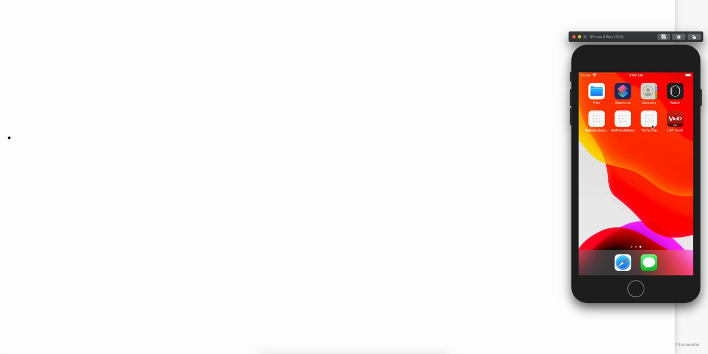

# RIBsTree

Real Time Uber RIBs Tree

  

## TODO

- [ ] Time Travel
- [ ] Full History Tree
- [ ] View Screenshot
- [ ] RIB Tree Node Metadata


## Using the Libraries

### Swift Package Manager
From Xcode 11, you can use `Swift Package Manager` to add RIBsTree to your project.

Select File > Swift Packages > Add Package Dependency. Enter https://github.com/dangthaison91/RIBsTree.git in the "Choose Package Repository" dialog.
In the next page, specify the version resolving rule as "branch" with "master" as its earliest version.
After Xcode checking out the source and resolving the version, you can choose the "RIBsTree" library and add it to your app target.


## Basic setup

```swift
import RIBsTree

@UIApplicationMain
public class AppDelegate: UIResponder, UIApplicationDelegate {
    
    public func application(_ application: UIApplication, didFinishLaunchingWithOptions launchOptions: [UIApplicationLaunchOptionsKey: Any]?) -> Bool {
        let window = UIWindow(frame: UIScreen.main.bounds)
        self.window = window

        let router = RootBuilder(dependency: AppComponent()).build().launchRouter
        self.launchRouter = router
        launchRouter.launch(from: window)

        #if DEBUG
        RIBsTreeViewer().start(from: router)
        #endif

        return true
    }
}
```

## Installing 

### Starting the websocket server

```shell
$ cd WebSocketServer
$ npm install
$ node index.js
```

## Open the page.

```shell
$ cd Browser
$ npm install
$ npm start
open localhost:8088 in Chrome/Safari browser
```

Credit:
RIBsTreeViewer: https://github.com/srea/RIBsTreeViewerClient